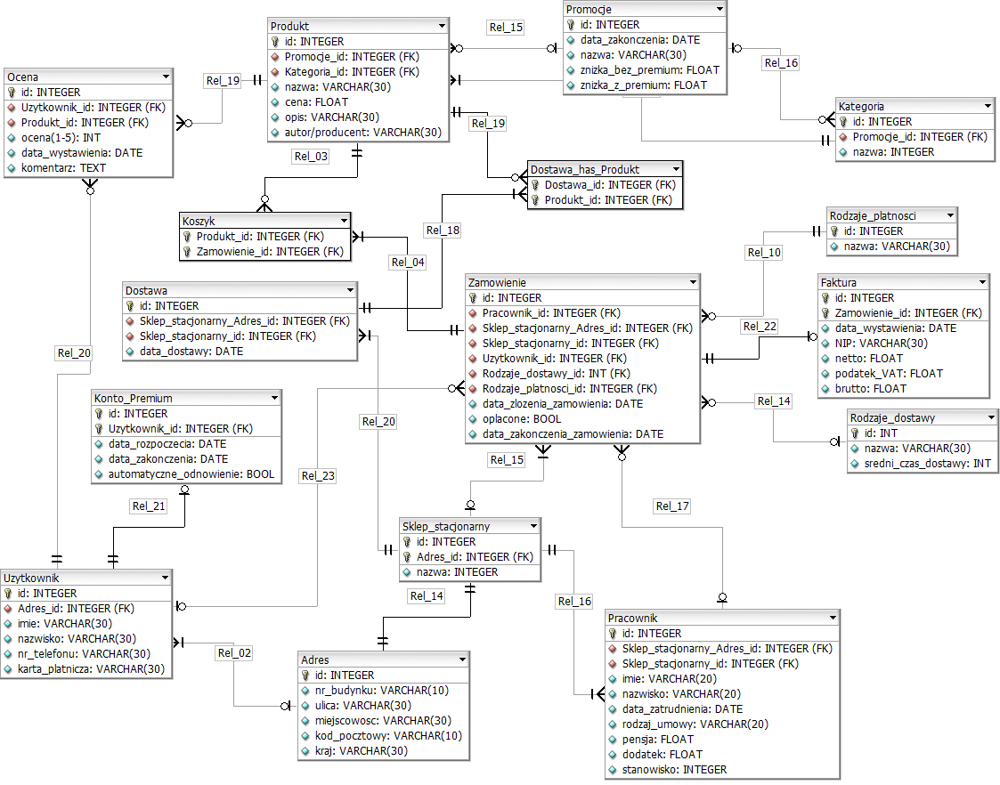

# Sklep internetowy - diagram ERD

Baza danych sklepu Empik. Sklep oferuje różne produkty takie jak książki, filmy i gry. Użytkownik musi posiadać konto w serwisie żeby mieć możliwość korzystania z promocji, ale nie musi posiadać konta gdy chce dokonać zakupu w sklepie stacjonarnym. Przypisanie adresu do konta nie jest wymagane, ponieważ klient może zamówić produkt do paczkomatu. Sklep oferuje różne promocje które różnią się w zależności od posiadania konta premium przez użytkownika. Sklep obsługuje różne rodzaje dostawy(tj. dostawa kurierem czy dostawa do paczkomatu) oraz różne rodzaje płatności(tj. karta płatnicza, przelew BLIK). Użytkownik może wystawiać oceny do produktów. Sklep ma możliwość wystawiania faktur.

<!-- ## Tabele

- Użytkownik
  - id
  - imie
  - nazwisko
  - nr_telefonu
-Adres
  - id
  - nr_domu
  - ulica
  - miejscowosc
  - kod-pocztowy
  - kraj
- Produkt
  - id
  - nazwa
  - cena
  - opis
  - autor/producent
- Stan_magazynu
  - id
  - ilosc
- Kategoria
  - id
  - nazwa
- Zamówienie
  - id
  - data_zamowienia
  - oplacone
- Konto Premium
  - id
  - data_rozpoczecia
  - data_zakonczenia
  - automatyczne_odnowienie
- Promocje
  - id
  - data_zakonczenia
  - nazwa
  - znizka_bez_premium
  - znizka_z_premium
- Rodzaje Płatności
  - id
  - nazwa
- Rodzaje Dostawy
  - id
  - nazwa
  - sredni_czas_dostawy
- Sklep_stacjonarny
  - id
  - nazwa
- Pracownicy
  - imie
  - nazwisko
  - data_zatrudnienia
  - pensja
-->

## Założenia

- Promocje mogą dotyczyć kategorii i produktów (np. druga książka 50% taniej albo konkretna gra 30% taniej)
- Kilka produktów/kategorii może mieć tą samą promocję, ale produkt/kategoria nie może mieć więcej niż jednej promocji na raz
- Każda kategoria ma przynajmniej jeden produkt
- Produkt musi miec kategorie
- Produkt może być dostępny wyłącznie przez internet
- Pracownik może pracować tylko w jednym sklepie na raz, w sklepie może pracować wielu pracowników
- Zamówienie nie musi mieć przypisanego użytkownika ani rodzaju dostawy, poniważ produkty mogły być zakupione w sklepie stacjonrnym
- Sklep stacjonarny, ani pracownik nie muszą być przypisani do zamównienia, gdy zamówienie było robiene przez sklep internetowy

[Lepszej jakosci zdjecie](https://github.com/DawidRoszman/Database_project/blob/master/version1.0.png)
